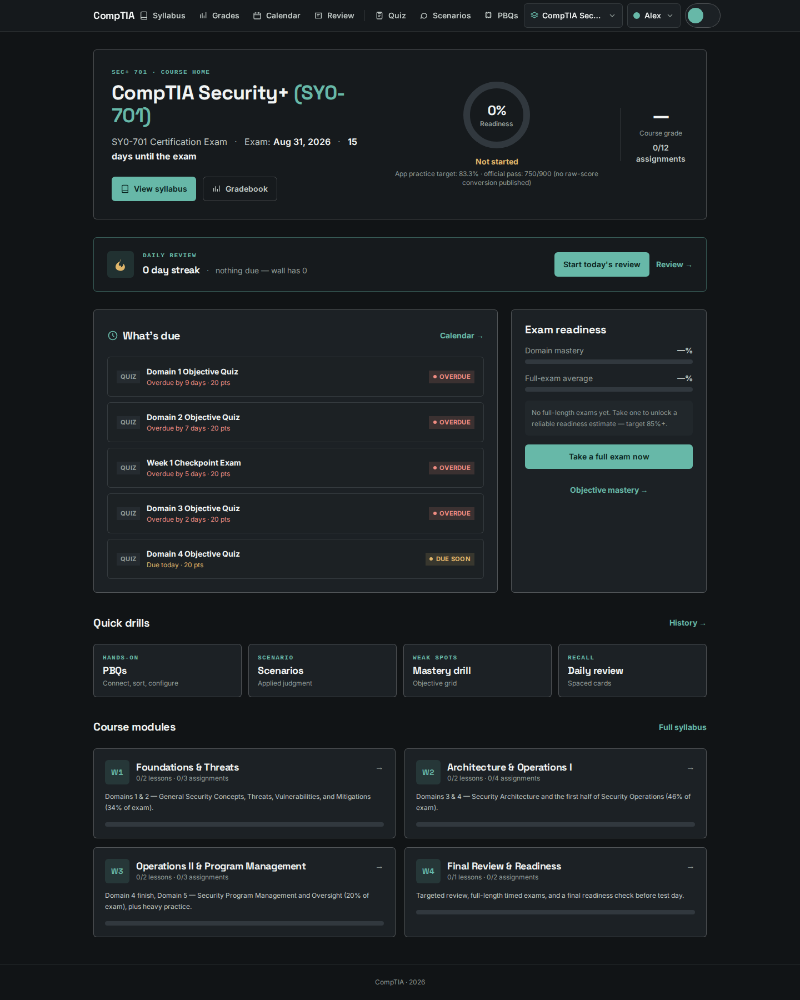
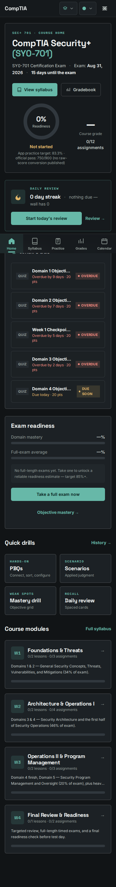
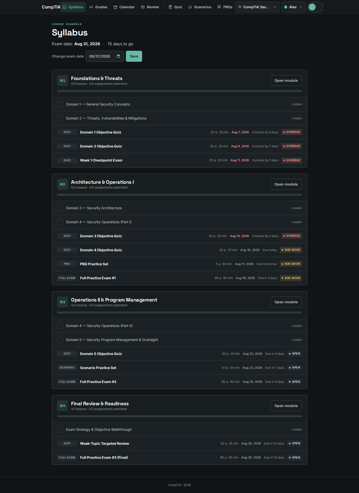
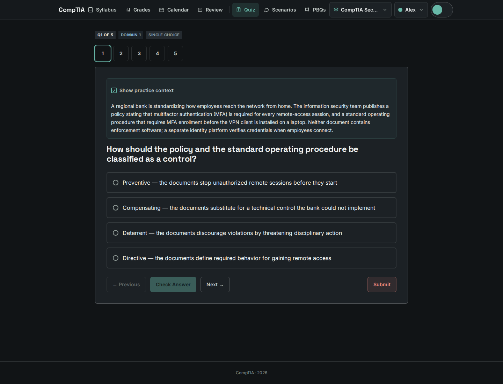
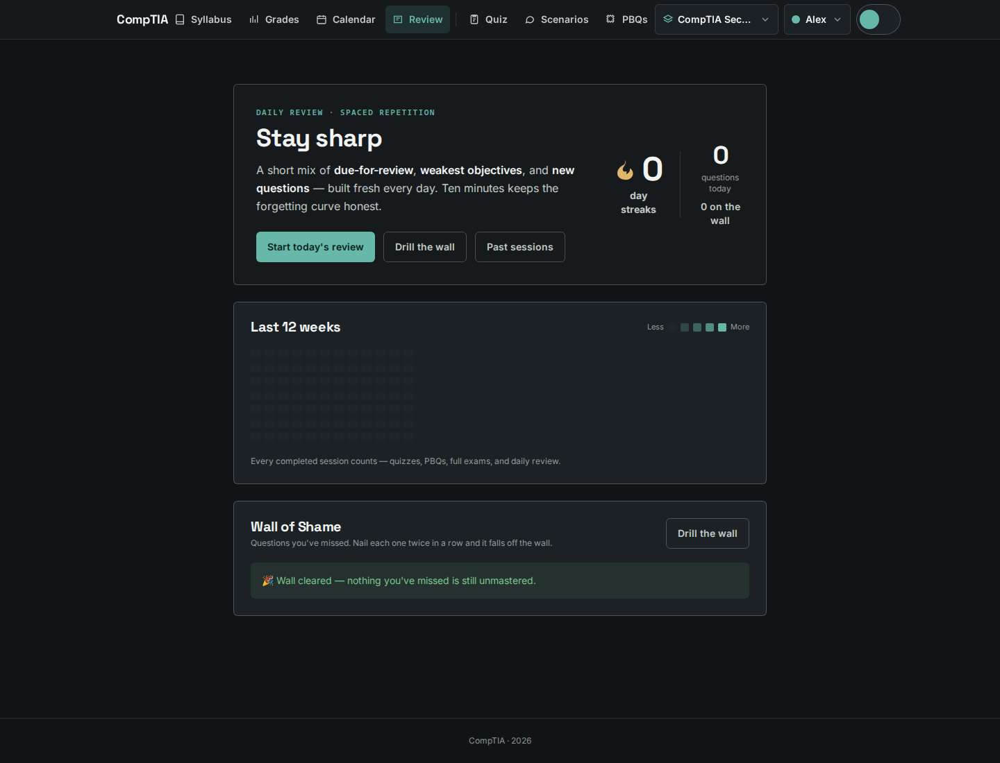
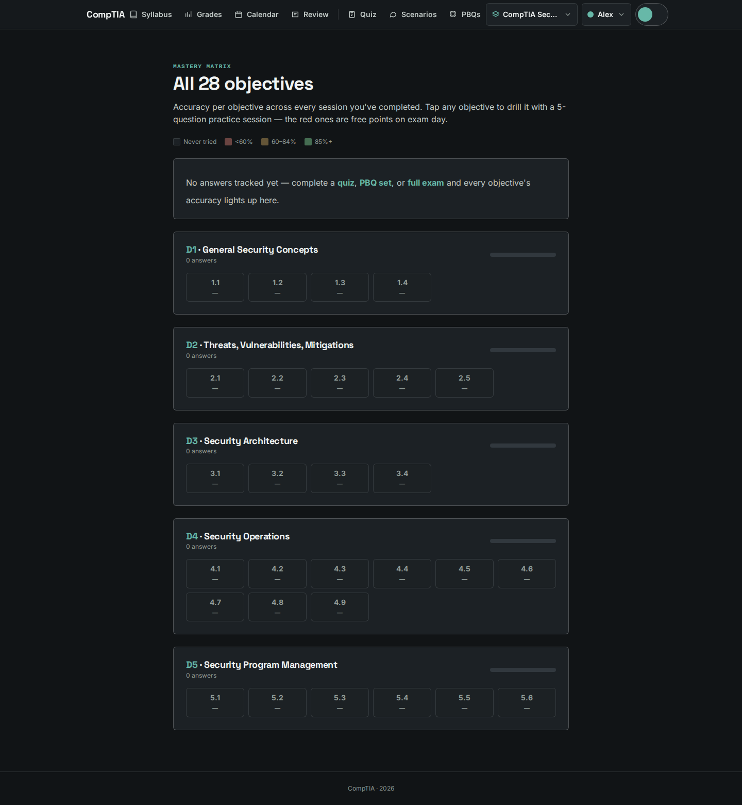

# CompTIA Security+ Course

An offline-first, Blackboard-style course learning system for preparing for the CompTIA Security+
(SY0-701) certification exam.

The app combines a structured four-week course plan with adaptive practice, graded assignments,
PBQs, full-length exams, spaced repetition, a weighted gradebook, and exam-readiness tracking. It is
designed for focused study on desktop or mobile and runs locally with SQLite.

> **A personal project first.** This is the tool I built and dogfooded for my own study sessions —
> the course plan, banks, and schedules are tuned for how *I* study, not a generic audience, and it
> isn't a configurable product. That said, it's open source for a reason: fork it, use it, and steal
> whatever ideas work for you. If you'd like to see it go further, PRs are welcome.



## Product Tour

### Course planning

The course home turns an exam date into an actionable study plan with countdown, readiness, daily
review, due assignments, quick drills, and module progress.



The syllabus lays out four weeks of lessons, objective quizzes, scenario sets, PBQs, and timed full
exams. Changing the exam date recalculates the schedule.



### Active practice

Practice sessions use scenario-based questions, objective labels, progress navigation, optional
context, and answer checks to turn the question bank into a guided drill.



### Targeted improvement

Daily review combines due cards, weak objectives, new questions, a study heatmap, and a Wall of Shame
for questions that need another pass.



The mastery matrix shows accuracy across all 28 SY0-701 objectives. Any objective can launch a
targeted five-question practice session.



## Features

- Four weekly modules covering all five Security+ exam domains
- Seven lessons with interactive study widgets
- Objective quizzes, scenario sets, PBQs, and 90-question timed full exams that mirror the real
  SY0-701: PBQs open the exam and carry ~26% of the score (5 PBQs at ~6 MCQ-points each), with
  domain quotas 11/20/16/25/18 across the five domains
- Interactive PBQ formats including matching, ordering, configuration, evidence, hotspot, sorting,
  word-bank, and multi-step tasks
- Daily spaced-repetition review with streaks, heatmap, and weak-topic recovery
- Mastery matrix across all 28 SY0-701 objectives
- Weighted gradebook with assignment statuses, retakes, category breakdowns, and letter grade
- Exam-readiness estimate against the official 750/900 passing threshold
- Multi-course support — Security+ SY0-701 plus A+ Core 1/2 (220-1201 / 220-1202) question banks
- Ready-to-import Anki flashcard decks — CSV exports for every domain plus ports/protocols and
  acronyms live in `anki/`, with matching flashcard notes in the vault
- Mobile-first — bottom navigation, ≥44px touch targets, and a layout that works one-handed between
  meetings
- Cheap to deploy — offline-first with self-hosted fonts and SQLite storage, no external services;
  runs on a single small VPS (or a free-tier host) via `make deploy` (systemd)
- Optional Google Calendar synchronization for exam and assignment deadlines
- Responsive dark study-tool interface with light-theme support

## Quick Start

Requirements: Node.js 22 or newer.

```bash
cd web
npm install
npm run dev
```

Open [http://localhost:5173](http://localhost:5173). The first run creates and seeds a local
`data/quiz.db` database. The default exam date is set automatically and can be changed from the
Syllabus page.

## Verify

Run these commands from `web/`:

```bash
npm run check
npm run test
npm run build
```

## Technology

- SvelteKit 5 with Svelte runes
- Tailwind CSS v4
- SQLite with `better-sqlite3`
- Vitest for unit and service tests
- Playwright for end-to-end coverage
- Self-hosted Inter and Space Grotesk fonts

## Project Layout

```text
web/                          Course learning app (SvelteKit 5)
├── src/routes/               Course pages and API routes
├── src/lib/components/       Shared UI and interactive PBQ components
├── src/lib/server/           SQLite services, course model, quiz engine, and review engine
├── scripts/                  Question-bank and content tooling
├── e2e/                      Playwright end-to-end tests
└── static/screenshots/       README product screenshots
notes/                        Obsidian study vault (domains, flashcards, exam resources)
anki/                         Anki flashcard exports
```

See [`web/README.md`](web/README.md) for the detailed architecture, data model, API route map,
authoring workflow, and deployment notes.

## Contributing

As noted up top, this is a personal, dogfood-first project rather than a configurable app. If you
find it useful (or just want to borrow the structure), please do — that's what it's here for. If
you hit a bug or have an idea, open a PR and I'll take a look.

## License

This project is released under the terms in [`LICENSE`](LICENSE).
